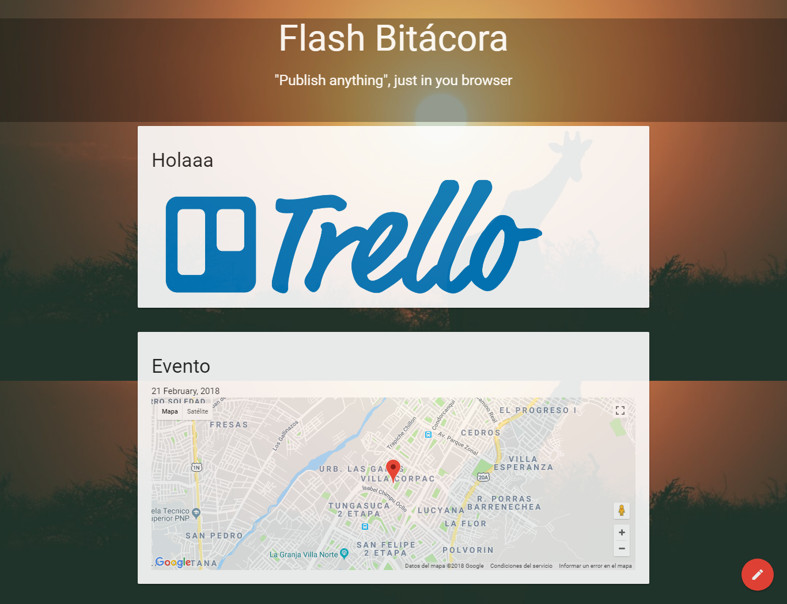

# **FLASH BITÁCORA**

> Recuerda seguir siempre esta [guía de estilos](https://github.com/Laboratoria/js-style-guide/)

* **Alumnas:** Laura Jimenez, Marina Rodriguez y Melina Pernia

## **HERRAMIENTAS:**  

* CSS3
* JavaScript(
* JQuery
* HTML5
* API file
* API Geolocation
* Materialize

## **DESCRIPCIÓN DEL PROYECTO:**
- Nos entregaron un ejemplo del proyecto en el cual teniamos que poder agregar imagenes, texto, audio, video y un mapa que diga la ubicacion del usuario que lo esta utilizando.

- Se tuvo que investigar las APIs y el código que se utiliza para mostrar las imagenes, audio o video.

- Se tuvo que implementar la API geolocation para que podamos ubicarnos en un mapa.

- Al recargar la página el background cambia.

## **RESULTADO:**

